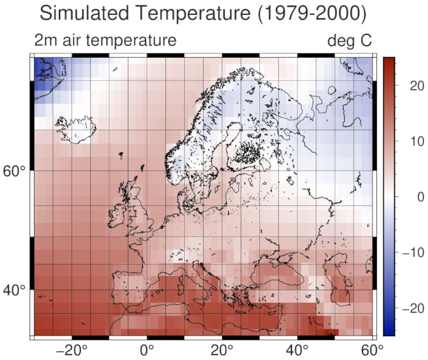

# <span style="color:#734f96">FPLT - Fortran Plotting Library</span>

<!-- markdownlint-disable -->
[](https://img.shields.io/github/license/sebastian-mutz/fplt/LICENSE)

<!-- markdownlint-enable -->

## <span style="color:#734f96">Description</span>


> [!IMPORTANT]
> FPLT is in a pre-alpha state, and only suitable for use by developers at this point.
>

A scientific plotting library for producing high-quality ("publication-ready") figures quickly by leveraging the GMT(Generic Mapping Tools) C-API and modern Fortran's derived types. FPLT includes procedures for producing geographical maps, xy-plots, heat maps, animated figures, and more.

FPLT includes a Fortran interface for several GMT modules (using GMT’s C API). Additional features, provided through an abstraction layer, include Fortran derived types for colour maps, font management, and options for specific kinds of plots. Furthermore, FPLT includes procedures for the automatic construction of colour maps and (the infamously cryptic) GMT argument strings from pre-defined or user-defined options.

The aim is to create a library that lets you:

 - visualise your data directly from your Fortran programme though familiar Fortran-native constructs,
 - produce professional figures quickly through the use of templates and automatic argument construction,
 - modify or create new templates easily from your programme.

## <span style="color:#734f96">Example</span>

The following code modifies a colour map template *cmap_bluered01* before creating a temperature map of Europe using the *map_default* template. All templates are simple derived types with initialised values that can be overwritten, as done with *cmap_bluered01* below. The *fplt_map* subroutine automatically generates gmt arguments (based on  *map_default* template) and works through a stack of gmt modules to successively build your map "behind the scenes".

```fortran
program check_maps01

! load modules
  use :: fplt

! basic options
  implicit none

! modify preset colour map
  cmap_bluered01%z_min = -25
  cmap_bluered01%z_max = 25
  cmap_bluered01%z_step = 1

! set plot labels
  map_default%title = "Simulated Temperature (1979-2000)"
  map_default%label_topleft = "2m air temperature"
  map_default%label_topright= "deg C"

! change colour map
  map_default%cmap="bluered01"

! plot map from text file using the default map template
  call fplt_map(DAT_map_default, "data_Mutz_et_al_2018.asc", "map01.pdf")

end program check_maps01
```

The code above will generate the map below:



## <span style="color:#734f96">Development</span>

FPLT is mostly developed “as needed” for my research. You are very welcome to contribute (through suggestions, coding, etc.) at any stage. The library is in early development stages, but already usable for a few type of plots. See details below.

## <span style="color:#734f96">Implemented and Planned Features</span>

### <span style="color:#734f96">Plot Types</span> <br/>


### <span style="color:#734f96">Progress Details</span> <br/>

| Feature                   | Implemented |
| ------------------------- | ----------- |
| Bindings for GMT C-APIs   | ✓           |
| Maps (Cylindrical Proj.)  | ✓           |
| Maps (Conic & Ortho Proj.)| -           |
| Heat maps                 | -           |
| XY scatter &  line plots  | -           |
| Bar plots                 | -           |
| GMT argument construction | 20%         |
| GMT module templates      | 20%         |
| Make colour maps          | 50%         |
| Auto label                | 80%         |
| Auto page setup           | -           |
| Read and convert text     | ✓           |
| Read and convert netcdf   | -           |


## <span style="color:#734f96">Installation</span>

FPLT can be installed/compiled with the [fortran package manager (fpm)](https://github.com/fortran-lang/fpm).
