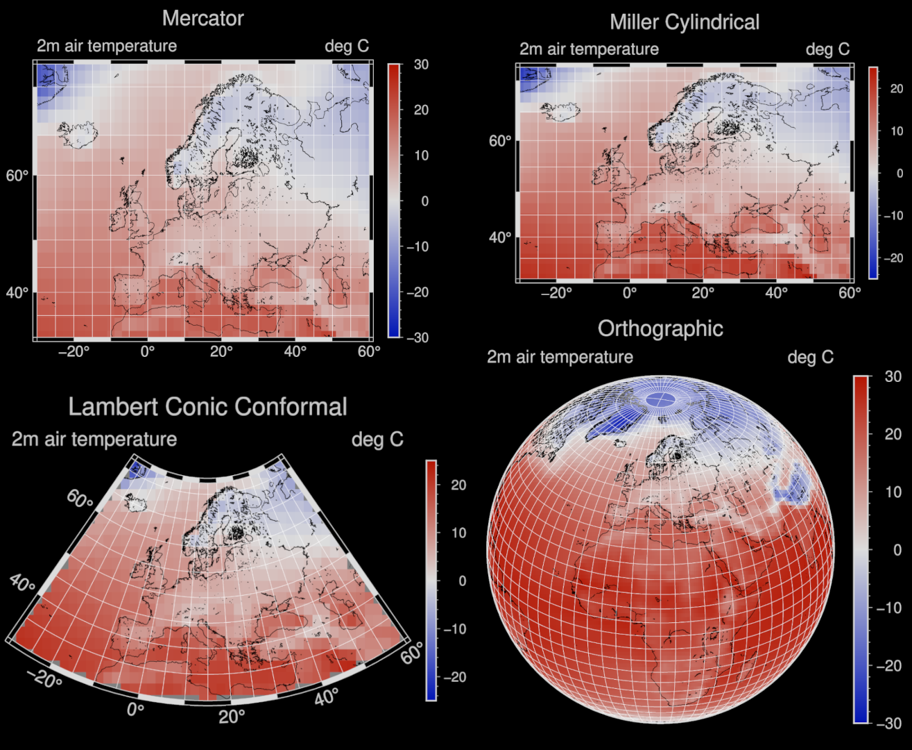

# <span style="color:#734f96">FPLT - Fortran Plotting Library</span>

[](https://github.com/sebastian-mutz/fplt/blob/main/LICENCE)


> [!IMPORTANT]
> FPLT is in a pre-alpha state, and only suitable for developers at this point.
>

 <!--
@warning
FPLT is in a pre-alpha state, and only suitable for developers at this point.
@endwarning
 -->

## <span style="color:#734f96">Description</span>


FPLT is a scientific plotting library for producing high-quality ("publication-ready") figures quickly by leveraging the GMT(Generic Mapping Tools) C-API and modern Fortran's derived types. FPLT includes procedures for producing geographical maps, xy-plots, heat maps, animated figures, and more.

FPLT includes a Fortran interface for several GMT modules (using GMT’s C API). Additional features, provided through an abstraction layer, include Fortran derived types for colour maps, font management, and options for specific kinds of plots. Furthermore, FPLT includes procedures for the automatic construction of colour maps and (the infamously cryptic) GMT argument strings from pre-defined or user-defined options.

The aim is to create a library that lets you:

 - visualise your data directly from your Fortran programme though familiar Fortran-native constructs,
 - produce professional figures quickly through the use of templates and automatic argument construction,
 - modify or create new templates easily from your programme.

## <span style="color:#734f96">Example</span>

The following code modifies a colour map template *cmap_bluered01* before creating a temperature map of Europe using the *map_default* template. All templates are simple derived types with initialised values that can be overwritten, as done with *cmap_bluered01* below. The *fplt_map* subroutine automatically generates gmt arguments (based on  *map_default* template) and works through a stack of gmt modules to successively build your map "behind the scenes".

```fortran
program main

! load modules and import map template to modify
  use :: fplt, my_map => DAT_map

! basic options
  implicit none

! set output file format
  my_map%infile  = "./test/maps/Mutz_et_al_2018_pd_temp2.asc"

! set plot labels
  my_map%title = "Simulated Temperature (1979-2000)"
  my_map%label_left = "2m air temperature"
  my_map%label_right= "deg C"

! change colour map
  my_map%cmap="bluered01"

! modify preset colour map
  my_map%z_min  = -30
  my_map%z_max  = 30
  my_map%z_step = 1

! change theme
  my_map%theme = "dark"

! change projection
  my_map%projection = "L"

! plot map using the modified copy of the DAT_map template
  call fplt_map(my_map)

end program main
```

The code above will generate the Lambert conic conformal projection map below (bottom left); not changing the projection will make FPLT default to a Mercator projection (top left). The Miller cylindrical and orthographic projection can be applied by setting the projection to *J* and *G*, respectively.



## <span style="color:#734f96">Development</span>

FPLT is mostly developed “as needed” for my research. As such, it will cover a lot of different plot styles, but its features will never be exhaustive. However, you are very welcome to contribute and add new features (through suggestions, coding, etc.) at any stage.

### <span style="color:#734f96">Alpha</span>

I will consider the library to be in "alpha" once FPLT covers all features needed to reproduce ~80% of all the plots I've created in the past ~15 years.

### <span style="color:#734f96">Beta</span>

This stage is reached once:

- FPLT is able to reproduce all of the above mentioned plots without issues.
- FPLT fully works with GFortran, LFortran, and Flang compilers.
- FPLT has proper documentation.


### <span style="color:#734f96">Implemented and Planned Features</span>

#### <span style="color:#734f96">Plot Types</span> <br/>


#### <span style="color:#734f96">Supported Map Projections</span> <br/>

| Map Projections           | Arg     |
| ------------------------- | ------- |
| Mercator                  | *M*     |
| Miller Cylindrical        | *J*     |
| Cylindrical Equidistant   | *Q*     |
| Lambert Conic Conformal   | *L*     |
| Albers Conic Equal-Area   | *B*     |
| Equidistant Conic         | *D*     |
| Transverse Mercator       | *T*     |
| Orthographic              | *G*     |

#### <span style="color:#734f96">Supported File Formats</span> <br/>

| Input   | Covered |
| ------- | ------- |
| grd     | ✓       |
| text    | ✓       |
| netcdf  | -       |

| Output  | Covered |
| ------- | ------- |
| ps      | ✓       |
| pdf     | ✓       |
| png     | ✓       |
| tif     | ✓       |
| jpg     | ✓       |
<br>

#### <span style="color:#734f96">Progress Details</span> <br/>

| Features                  | Implemented |
| ------------------------- | ----------- |
| Bindings for GMT's C-API  | ✓           |
| Geographical maps         | ✓           |
| Common map projections    | ✓           |
| Heat maps                 | 20%         |
| XY scatter and line plots | -           |
| Bar plots                 | -           |
| GMT argument construction | 40%         |
| GMT module templates      | 20%         |
| GMT auto settings         | 50%         |
| Themes for plot setting   | ✓           |
| Auto generate colour maps | ✓           |
| Auto label and positioning| ✓           |
| Auto crop                 | ✓           |
| Output file format options| ✓           |
| Read and convert text     | ✓           |
| Read and convert netcdf   | -           |

## <span style="color:#734f96">Installation</span>

FPLT can be installed/compiled with the [fortran package manager (fpm)](https://github.com/fortran-lang/fpm). You will need to make sure you have the [Generic Mapping Tools (GMT) 6](https://github.com/GenericMappingTools) lib installed and properly linked.


